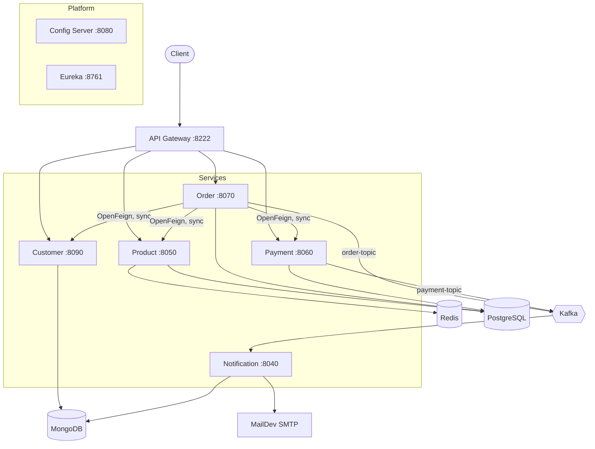

# Retail Microservices Platform

A Spring Boot microservices backend for a retail store: customers place orders, stock is reserved, payment is processed, and confirmation emails are sent asynchronously over Kafka.

Eight services behind an API gateway, with Redis caching, Prometheus/Grafana metrics, distributed tracing, and load tests measuring what the cache and JVM virtual threads actually do under concurrency.

---

## Architecture



**Order flow.** A request reaches Order through the gateway. Order synchronously checks the customer exists, reserves stock in Product, persists the order, and calls Payment - all over OpenFeign, so the caller doesn't get a response until payment has gone through. Order and Payment then each publish a confirmation event to Kafka. Notification consumes both, stores a record in MongoDB, and sends two emails (order confirmation and payment receipt) rendered from Thymeleaf templates.

The split is deliberate: payment has to resolve before the request returns, while email delivery shouldn't block the caller and shouldn't be able to fail an order that was already paid for.

| Service | Port | Storage |
|---|---|---|
| Gateway | 8222 | - |
| Eureka | 8761 | - |
| Config Server | 8080 | - |
| Customer | 8090 | MongoDB |
| Product | 8050 | PostgreSQL + Redis |
| Order | 8070 | PostgreSQL |
| Payment | 8060 | PostgreSQL |
| Notification | 8040 | MongoDB |

**Stack.** Java 21 · Spring Boot 4 · Spring Cloud (Gateway, Config, OpenFeign, Eureka) · Kafka · PostgreSQL · MongoDB · Redis · Flyway · Keycloak · Prometheus + Grafana · Zipkin · k6 · Testcontainers · Docker Compose

---

## Performance

Measured locally with k6, so the absolute numbers are machine-specific - the comparison between runs is the point.

### Redis cache layer

`ProductService.findById` is `@Cacheable` with a one-hour TTL; writes evict the entry. Load profile: ramp to 300 VUs, hold, random `GET /api/v1/products/{id}` through the gateway.

| | Without Redis | With Redis | Change |
|---|---|---|---|
| p95 latency | 246 ms | 109 ms | **−55.8%** |
| avg latency | 85 ms | 47 ms | −44.9% |
| Throughput | 1,874 req/s | 3,322 req/s | **+77%** |
| Error rate | 0% | 0% | - |

Throughput rose *because* latency fell. The load profile was identical in both runs, so each request finished sooner and the same 300 VUs completed more iterations - one effect, not two.

The cache sits on `findById` rather than `findAll`: single lookups are the hot path and have a natural key, while `findAll` would mean one large value invalidated by every write.

### Virtual threads

Same script at 500 VUs, cache disabled, toggling `spring.threads.virtual.enabled`. Three runs without, two with; spread within each group was under 10 ms.

| | Platform threads | Virtual threads | Change |
|---|---|---|---|
| p95 latency | 438 ms | 364 ms | **−17%** |
| median latency | 158 ms | 245 ms | +55% |
| Throughput | 1,924 req/s | 1,815 req/s | −5.6% |
| Error rate | 0% | 0% | - |

Virtual threads did **not** make the service faster overall - throughput dropped slightly and the median request got slower. What improved is the tail: p95 came in under the 400 ms threshold that platform threads missed in every run.

The likeliest reading is that the bottleneck here is the connection pool (10 by default), not the thread model. With platform threads, 200 Tomcat threads compete for those connections while the rest of the requests queue behind them - two layers of queueing, producing a long, uneven tail. Virtual threads remove the 200-thread ceiling, so requests contend at one layer instead of two: a tighter tail, a longer typical wait. That's an interpretation of the numbers rather than something profiled down to the pool, and it would be worth testing at higher concurrency.

Scripts in [`load-tests/`](load-tests/).

---

## Running it

Requires Docker, JDK 21 and Maven.

```bash
cd infra && docker compose up -d          # Postgres, Mongo, Kafka, Redis, Keycloak, observability
./mvnw -f services/config-server spring-boot:run
./mvnw -f services/discovery     spring-boot:run
./mvnw -f services/gateway       spring-boot:run
# then customer, product, order, payment, notification in any order
```

Flyway applies the Product schema and seed data on first start.

```bash
./mvnw test                                    # unit tests + Testcontainers integration tests
k6 run load-tests/product-load-test-redis.js   # reproduce the benchmark
```

| | |
|---|---|
| Swagger UI | http://localhost:8222/swagger-ui.html |
| Grafana | http://localhost:3000 |
| Prometheus | http://localhost:9090 |
| Zipkin | http://localhost:9411 |
| MailDev inbox | http://localhost:1080 |
| Keycloak | http://localhost:9098 |

---

## Tests

Unit tests with Mockito cover the service layer. One integration test runs against real PostgreSQL and Redis containers, since mocks can't show that caching actually happens or that a write commits.

| Test | Covers |
|---|---|
| `ProductServiceTest` | purchase quantity maths, duplicate IDs, missing product, insufficient stock, findById |
| `ProductCacheIntegrationTest` | cache populated on read, evicted on purchase, stock changes actually commit |
| `OrderServiceTest` | customer validation, create flow, order lines, payment request contents |
| `PaymentServiceTest` | payment persisted, notification published |

Not covered on purpose: Customer and Notification (thin CRUD and an `@Async` mail sender), the gateway, and controller-level slices.

Service classes are annotated `@Transactional(readOnly = true)` with explicit overrides on write methods, so a query path can't accidentally flush changes.
